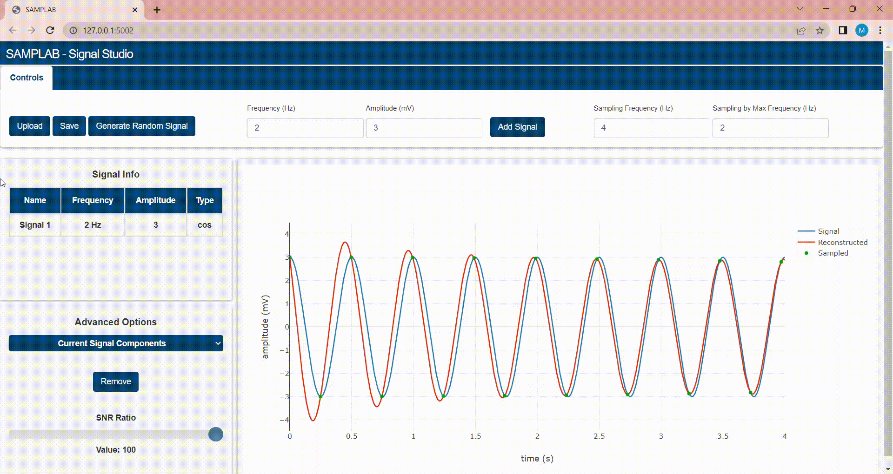
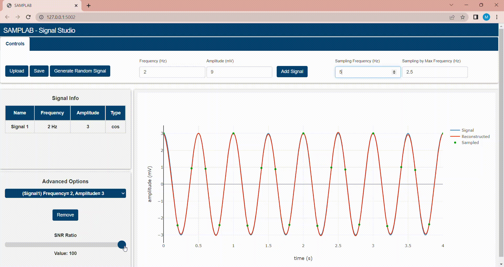

# Signals Sampling Studio - DSP Task 1 

## Table of contents:
- [Introduction](#introduction)
- [Quick Preview](#quick-preview)
- [Project Features](#project-features)
- [Project Structure](#project-structure)
- [How to Run The Project](#run-the-project)
- [Team]()


### Introduction
Any digital signal processing system must first sample an analogue signal.
When sampling at a frequency greater than or equal to the signal's bandwidth,
the Nyquist-Shannon sampling theorem ensures that the signal will fully recover
(or double the maximum frequency in case of real signals).

### Quick Preview
Web application using frontend technologies & flask for illustrating how the sampling theory work,
applying Nyquist sampling, validating it and reconstructing the signal again from the sample points. It can also 
generate signals with various frequencies , amplitudes, sum them up or remove them to make a new signal.

The Sampling is done with Nyquist sampling while the reconstruction using Whittaker–Shannon
interpolation formula.

`Sampling Formula -> Fsample >= 2 * Fmaximum`


### Project Features
In this web application you can
> 1. Upload signals from your computer as CSV file format


> 2. Generate random signals from signal composer

> 3. Remove signal components from the current signal



> 4. Add signal from signal composer by your frequency and amplitude

> 5. Remove signal components from the current signal


> 6. Add Noise to the signal



> 7. Sample signal

> 8. Reconstruct signal from sampled signa .

### Project Structure
The Web Application is built using:
- Frontend:
  - HTML
  - CSS
  - JavaScript
  - BootStrap
  - Ajax
- Backend framework:
  - Flask (Python)

The Frontend main function to set the structure of the page and plot the signals and mange
the user interface while the backend function is to do on-signal operations like sampling,
reconstructing, adding signal, adding noise & removing signal.

**Ajax** is used to make client-server requests without the need to reload the whole page for
an action to be done.

```
master
├─ data
│  ├─ signals data
│  └─ readme data
├─ static (JS & CSS files)
│  ├─  css
│  └─  js
├─ template (HTML files)
├─ app.py (Back-End Server)
└─ README.md
```

### Run the Project 
1. Install Python3 in your computer
``` 
Download it from www.python.org/downloads/
```
2. Install the following packages
   - numpy
   - flask
   - flask_cors
 - Open Project Terminal & Run
```
pip install -r requirments.txt
```
3. Start Server by Running 
```
python app.py
```

4. Visit http://127.0.0.1:5002

### Team
First Semester - Biomedical Digital Signal Processing (SBE3110) class project created by:

| Team Members' Names                                   | Section | B.N. |
|-------------------------------------------------------|:-------:|:----:|
| [Ibrahim Mohamed](https://github.com/1brahimmohamed)  |    1    |  2   |
| [Maye Khaled](https://github.com/mayekhaled0)         |    2    |  40  |
| [Amar Al Anany](https://github.com/amaralanany12345)  |    2    |  1   |
| [Rawan Ghanem](https://github.com/rawan-ghanem)       |    1    |  33  |

### Submitted to:
- Dr. Tamer Basha & Eng. Mohamed Mostafa
All rights reserved © 2022 to Team 10 - Systems & Biomedical Engineering, Cairo University (Class 2024)